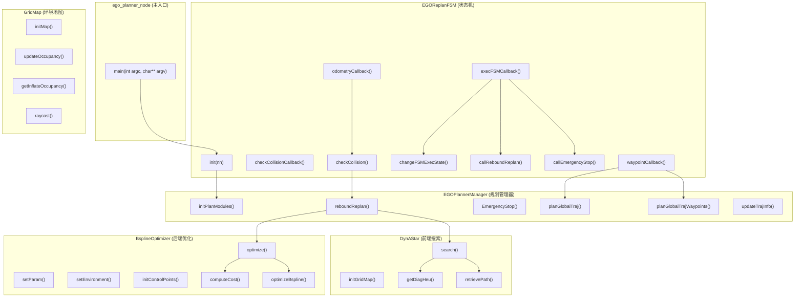
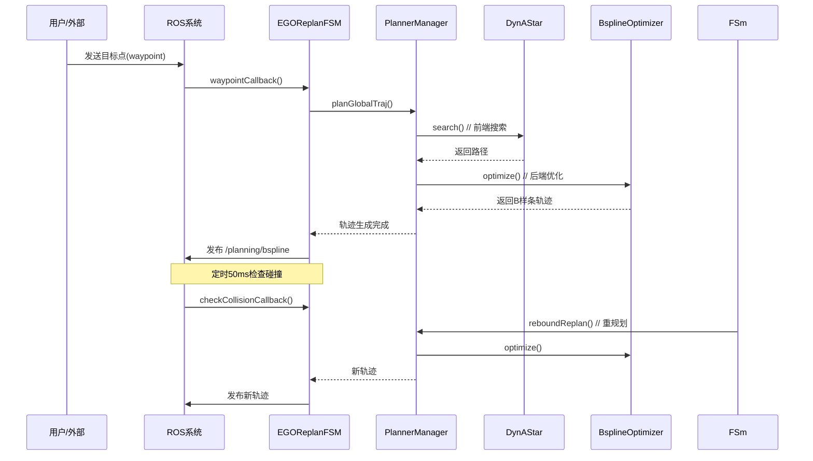

# ego-planner 函数调用关系与UML图

## 1. UML类图



---

## 2. 函数详细说明

### 2.1 主入口函数

#### main() - ego_planner_node.cpp
```cpp
int main(int argc, char **argv)
```
**功能**: 程序的入口点，初始化ROS节点并启动状态机
**调用**: → EGOReplanFSM::init()

---

### 2.2 EGOReplanFSM 类 (状态机)

#### init(nh)
**功能**: 初始化状态机，包括：
- 读取参数 (fsm/thresh_replan, waypoints等)
- 初始化可视化模块
- 创建ROS定时器 (exec_timer_, safety_timer_)
- 订阅话题 (/odom_world, /waypoint_generator/waypoints)
- 发布话题 (/planning/bspline)

#### execFSMCallback()
**功能**: 状态机主回调函数，每10ms执行一次
**调用**:
- → timesOfConsecutiveStateCalls() 判断当前状态
- → changeFSMExecState() 状态转换
- → callReboundReplan() 触发重规划
- → callEmergencyStop() 紧急停止

#### checkCollisionCallback()
**功能**: 碰撞检测回调，每50ms执行一次
**调用**:
- → checkCollision() 检测是否碰撞
- 超过阈值则触发REPLAN_TRAJ

#### waypointCallback(msg)
**功能**: 接收目标点消息
**调用**:
- → planner_manager_->planGlobalTraj() 生成全局轨迹

#### odometryCallback(msg)
**功能**: 接收里程计数据，更新无人机位置/速度/加速度
**更新变量**: odom_pos_, odom_vel_, odom_acc_

#### changeFSMExecState(new_state, pos_call)
**功能**: 状态机状态转换
**状态**: INIT → WAIT_TARGET → GEN_NEW_TRAJ → EXEC_TRAJ → REPLAN_TRAJ → EMERGENCY_STOP

#### callReboundReplan(flag_use_poly_init, flag_randomPolyTraj)
**功能**: 调用重规划算法
**调用**: → EGOPlannerManager::reboundReplan()

#### callEmergencyStop(stop_pos)
**功能**: 紧急停止
**调用**: → EGOPlannerManager::EmergencyStop()

#### checkCollision()
**功能**: 碰撞检测
**调用**: → grid_map_->getInflateOccupancy() 检测障碍物

---

### 2.3 EGOPlannerManager 类 (规划管理器)

#### initPlanModules(nh, vis)
**功能**: 初始化所有规划模块
- 读取参数 (max_vel, max_acc, max_jerk等)
- 初始化 GridMap
- 初始化 BsplineOptimizer
- 初始化 A* 搜索

#### reboundReplan(start_pt, start_vel, start_acc, local_target_pt, ...)
**功能**: 局部重规划（核心函数）
**流程**:
1. 计算时间参数 ts
2. 生成初始多项式轨迹
3. → BsplineOptimizer::optimize() 优化轨迹
4. 返回 UniformBspline

#### planGlobalTraj(start_pos, start_vel, start_acc, end_pos, ...)
**功能**: 全局轨迹规划
**流程**:
- 生成起点到终点的初始轨迹
- → optimize() 后端优化

#### planGlobalTrajWaypoints(start_pos, ..., waypoints, ...)
**功能**: 多路点全局规划
**流程**:
- 依次规划经过各路点的轨迹
- → visualize_->displayGlobalPathList() 可视化

#### EmergencyStop(stop_pos)
**功能**: 紧急停止，生成停止轨迹

#### updateTrajInfo(position_traj, time_now)
**功能**: 更新轨迹信息
- 更新时间戳
- 计算速度/加速度

---

### 2.4 GridMap 类 (环境地图)

#### initMap(nh)
**功能**: 初始化3D地图
- 设置地图参数 (origin, size, resolution)
- 初始化点云处理

#### updateOccupancy(point, occupied)
**功能**: 更新占据状态
- 使用光线投射算法
- 更新voxel哈希表

#### getInflateOccupancy(point)
**功能**: 检测点是否被占据（带膨胀）
- 返回 bool: 是否可通行

#### raycast(start, end, visited)
**功能**: 光线投射
- 检测两点之间是否有障碍物

---

### 2.5 DynAStar 类 (前端搜索)

#### initGridMap(occ_map, pool_size)
**功能**: 初始化A*搜索用的网格
- 创建3D网格节点池

#### search(start_idx, end_idx)
**功能**: A*路径搜索
**流程**:
1. 广度优先搜索扩展节点
2. 使用对角线启发函数
3. → retrievePath() 回溯路径
**返回**: vector<GridNodePtr> 路径点

#### getDiagHeu(node1, node2)
**功能**: 计算对角线启发函数代价
```
h = √3*diag + √2*min(dx,dy,dz) + |dx-dy-dz|
```

#### retrievePath(current)
**功能**: 从终点回溯到起点获取路径

---

### 2.6 BsplineOptimizer 类 (后端优化)

#### setParam(nh)
**功能**: 设置优化参数
- lambda1 (平滑权重)
- lambda2 (碰撞权重)
- lambda3 (可行性权重)
- lambda4 (拟合权重)

#### setEnvironment(grid_map)
**功能**: 设置环境地图引用

#### initControlPoints(init_points)
**功能**: 初始化控制点
- 根据障碍物分割轨迹段
- 分配初始控制点位置

#### optimize()
**功能**: B样条轨迹优化（主函数）
**流程**:
1. → initControlPoints() 初始化
2. → computeCost() 计算代价
3. → optimizeBspline() 梯度下降优化
4. 返回优化后的 UniformBspline

#### computeCost()
**功能**: 计算优化代价函数
```
Cost = λ1*smoothness + λ2*collision + λ3*feasibility + λ4*fitness
```

#### optimizeBspline()
**功能**: 梯度下降优化
- 使用共轭梯度法
- 迭代优化控制点位置

---

## 3. 数据流图

```
用户输入/ROS消息
     │
     ▼
┌─────────────────┐
│  waypointCallback  │ ← 目标点
│  odometryCallback  │ ← 里程计
└────────┬──────────┘
         │
         ▼
┌─────────────────┐
│  EGOReplanFSM   │ ← 状态机
│  execFSMCallback │ ← 主循环(10ms)
└────────┬──────────┘
         │
    ┌────┴────┐
    ▼         ▼
┌───────┐ ┌───────┐
│ 碰撞  │ │ 轨迹  │
│检测   │ │ 执行  │
└───┬───┘ └───┬───┘
    │         │
    ▼         ▼
┌─────────────────┐
│ EGOPlannerManager │
│  reboundReplan() │
└────────┬──────────┘
         │
    ┌────┴────┐
    ▼         ▼
┌───────┐ ┌───────┐
│DynAStar│ │Bspline│
│ 搜索  │ │ 优化  │
└───┬───┘ └───┬───┘
    │         │
    └────┬────┘
         │
         ▼
┌─────────────────┐
│  /planning/bspline │
│    输出轨迹       │
└─────────────────┘
```

---

## 4. 时序图



---

## 5. 文件索引

| 文件 | 类/函数 | 功能 |
|------|---------|------|
| ego_planner_node.cpp | main() | 主入口 |
| ego_replan_fsm.cpp/h | EGOReplanFSM | 状态机 |
| planner_manager.cpp/h | EGOPlannerManager | 规划管理器 |
| grid_map.cpp/h | GridMap | 环境地图 |
| dyn_a_star.cpp/h | AStar | A*搜索 |
| bspline_optimizer.cpp/h | BsplineOptimizer | B样条优化 |
| uniform_bspline.cpp/h | UniformBspline | B样条曲线 |
